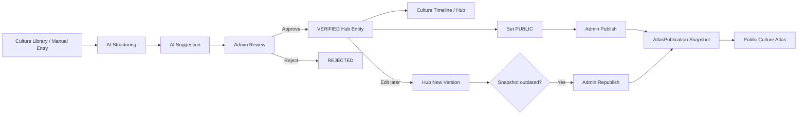
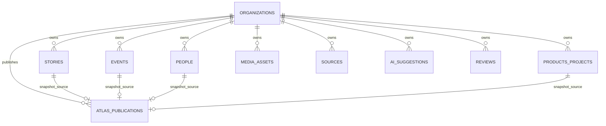
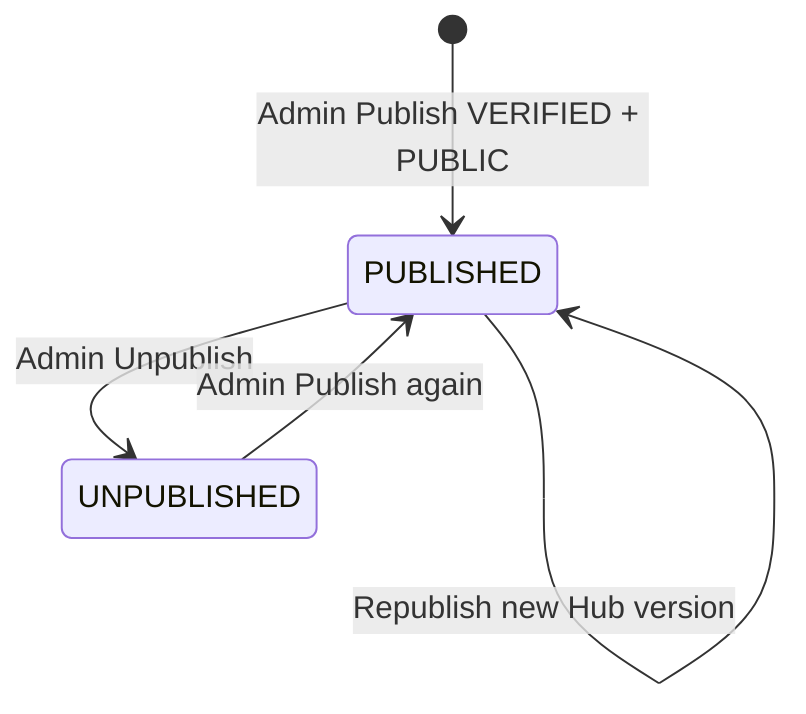

# NexTure MVP V2 Architecture

## End-to-end flow

## Data ownership

`ATLAS_PUBLICATIONS` uses polymorphic `EntityType + EntityId`, so the four lines above are logical relationships rather than database foreign keys.

## Atlas publication state

## Key invariant

Public Atlas APIs never query mutable Stories/Events/People/Products directly for public content. They only read `AtlasPublications` where `Status = PUBLISHED`.

This preserves explicit human publishing control.
